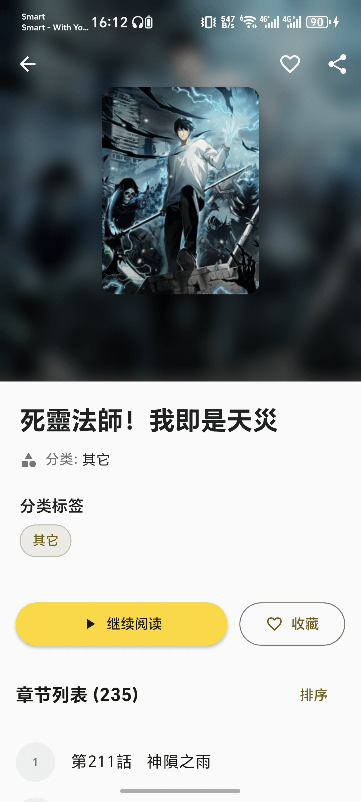

# 包子漫画（Baozi Comic）

一个使用 Flutter + GetX 构建的跨平台漫画应用，解析并展示包子漫画（`https://www.baozimh.com/`）内容，支持搜索、详情、章节阅读、历史与收藏，并针对 Web/移动端做了性能与交互优化。

## 功能概览
- 首页7大板块：热门、推荐国漫、推荐韩漫、推荐日漫、热血、最新上架、最近更新
- 搜索结果卡片按 285×375 比例显示，并展示“更新至XX”
- 详情页：标题/作者/状态/标签/简介，动态 SliverAppBar（展开白/收缩黑），背景高斯模糊+前置封面
- 阅读器：
  - 垂直模式 `ListView.builder`，按图片原始宽高自适应
  - 图片默认充满屏宽，按 AMP `amp-img` 的 `width/height` 比例算高
  - 滚动自动隐藏浮层，长按显示；点击图片进入放大预览（PhotoView）
  - 显示分页信息（第X页/共Y页）
- 本地存储：阅读历史与收藏（Shared Preferences）
- 图片缓存（cached_network_image）
- 启动页（flutter_native_splash）与应用图标（flutter_launcher_icons）

## 运行预览（images/）

### 首页


### 搜索


### 漫画详情


### 阅读器


### 收藏


### 历史


## 技术栈
- Flutter 3.x、GetX（状态/DI/路由）
- http + html（网络与解析）
- json_serializable（模型）
- cached_network_image、photo_view
- shared_preferences、url_launcher
- flutter_launcher_icons、flutter_native_splash

## 快速开始

### 环境
- Flutter（建议使用 fvm）
- Dart SDK

### 安装依赖
```bash
flutter pub get
```

### 运行
```bash
# 运行到连接设备/模拟器
flutter run

# 指定设备（示例：Web）
flutter run -d chrome
```

### 构建
```bash
# Android Debug APK
flutter build apk --debug

# Web 构建
flutter build web
```

## 配置要点
- 启动页：`assets/app_icon_512.png`，亮色 `#FFD700`，暗色 `#B8860B`
- 全局主题：金黄色（seed `#FFD700`，AppBar/按钮等统一）
- 搜索卡片：Grid childAspectRatio≈`285 / (375 + 50)`，为图片+文本综合比例

## 目录结构
```
lib/
  controllers/   # GetX 控制器
  models/        # 数据模型
  pages/         # 页面（首页、详情、阅读、搜索、书架等）
  services/      # 网络、解析、业务服务
  widgets/       # 通用组件
assets/
  app_icon_512.png
images/
  home.png
  search.png
  detail.png
  read.png
  favoriate.png
  history.png
```

## 版权声明
- 仅用于技术学习与交流，请勿商用。
- 数据来自公开网页，如有侵权请联系删除。

---
欢迎提交 Issue / PR 进行改进 🙌
